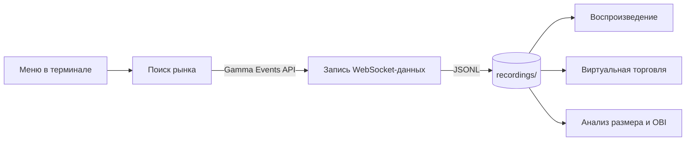

# Order Book Recorder

Интерактивное Rust-приложение для записи стаканов 15-минутных рынков Polymarket по BTC, ETH, SOL и XRP, последующего воспроизведения записей и анализа данных.
Проект непосредственно связан с https://github.com/0xMatShi/kraken - HTF-ботом для Polymarket'а и исползует его стратегии для симуляции торговли

## Overview

Программа запускается как CLI с меню в терминале. В режиме записи она находит активный рынок, срок которого истекает в ближайшие 15 минут, подключается к публичному WebSocket Polymarket и сохраняет данные в JSON Lines. Остальные режимы читают эти локальные файлы: показывают воспроизведение стакана, моделируют сделки с виртуальным балансом или отслеживают появление заявок заданного размера.

Это локальное приложение: оно не поднимает HTTP-сервер, не отправляет реальные торговые ордера и не использует базу данных. Записи хранятся в `recordings/` относительно текущей рабочей директории.



## Features

- Непрерывный поиск 15-минутных рынков BTC, ETH, SOL и XRP, а затем запись до окончания рынка.
- Запись bid-стаканов исходов UP и DOWN: до 12 ценовых уровней на сторону. Полные снимки добавляются, когда сообщения обеих сторон имеют общий серверный timestamp; также сохраняются изменения `BUY` из `price_change`.
- Сохранение метаданных рынка, серверного времени событий и средней измеренной задержки между серверным timestamp и локальным временем получения.
- TUI для воспроизведения записей с перемоткой и регулировкой скорости.
- Виртуальная торговля по встроенной стратегии закрытия спреда с отображением ордеров, портфеля и результата. Симуляция использует начальный виртуальный баланс $5 000 и заявки размером в одну долю, оценивает исполнения по изменениям стакана и предполагаемой позиции в очереди, работает только на загруженной записи и не взаимодействует с торговым API.
- Анализ заявок заданного размера на первых шести уровнях стакана, предполагаемой очереди, исполнений и отмен; интерфейс также показывает OBI (дисбаланс стакана). Сопоставление размера заявки допускает отклонение менее 0,5.

## Tech Stack

- **Язык:** Rust 2021 edition.
- **Асинхронный ввод-вывод и сеть:** Tokio, Reqwest, tokio-tungstenite, futures-util.
- **Модели и данные:** Serde, serde_json, Chrono.
- **Терминальный интерфейс:** Ratatui, Crossterm.
- **Логирование и ошибки:** tracing, tracing-subscriber, anyhow.
- **Формат хранения:** локальные JSON Lines-файлы; отдельная СУБД, очередь или кеш не используются.
- **Внешние сервисы:** публичный Polymarket Gamma Events API и CLOB Market WebSocket.

## Architecture

`src/main.rs` управляет меню и связывает режимы. В режиме Download `AutoScanner` запрашивает события Gamma API, выбирает активный рынок по slug и сроку окончания, а `Recorder` подписывается на токены UP и DOWN через CLOB Market WebSocket. `RecordingStorage` пишет метаданные и события в JSONL-файл. Режимы Replay, Demo-Trading и Size Analysis загружают файл через тот же модуль хранения и передают запись своим плеерам и TUI.

Сканер повторяет поиск каждые 5 секунд, если подходящий рынок не найден. При отключении WebSocket запись переподключается. Это приложение использует API Polymarket как источник данных, но само не предоставляет API.

## Recordings

Файл создаётся в `recordings/<slug>_<UTC-время начала>.jsonl`. Первая JSONL-строка содержит метаданные рынка; последующие строки — снимки стакана или события `price_change`. При чтении события изменения применяются к предыдущему снимку, чтобы восстановить последовательность состояний. События `price_change`, пришедшие до первого полного снимка, пропускаются. Каталог `recordings/` исключён из Git через `.gitignore`.

## Project Structure

```text
.
├── Cargo.toml                 # бинарный crate и зависимости
├── Cargo.lock                 # зафиксированные версии зависимостей
└── src/
    ├── main.rs                # точка входа и интерактивное меню
    ├── download/
    │   ├── scanner.rs         # поиск рынков через Gamma Events API
    │   ├── recorder.rs        # WebSocket-подписка, сбор и упорядочивание событий
    │   └── storage.rs         # запись и загрузка JSONL
    ├── models/                # модели рынков, WebSocket-сообщений и записей
    ├── replay/                # плеер и TUI воспроизведения стакана
    ├── demo_trading/          # симулятор стратегии и его TUI
    └── analysis/              # трекер размера заявок, OBI и TUI анализа
```

## Requirements / Prerequisites

- Rust toolchain и Cargo с поддержкой Rust 2021 edition. `Cargo.toml` не задаёт минимальную версию Rust.
- Интерактивный терминал с поддержкой режима raw input и alternate screen для TUI.
- Доступ в интернет к `https://gamma-api.polymarket.com/events` и `wss://ws-subscriptions-clob.polymarket.com/ws/market` для записи данных.
- Системная библиотека TLS, требуемая native TLS-зависимостями проекта. На Linux сборке могут понадобиться системные OpenSSL development libraries; точные команды установки пакетов в репозитории не заданы.

Для воспроизведения и анализа достаточно уже созданных файлов записей; сетевое подключение для этих режимов не требуется.

## Installation

```bash
git clone https://github.com/0xMatShi/OrderBookRecorder.git
cd OrderBookRecorder
cargo build --release
```

## Configuration

Файл `.env.example` и загрузчик `.env` в проекте отсутствуют. API-ключи и другие credentials в коде не требуются. Каталог записей задан константой `recordings` в `src/main.rs` и создаётся автоматически при запуске режима, которому нужно хранилище.

| Переменная | Обязательна | Назначение | Значение по умолчанию |
|---|---:|---|---|
| `RUST_LOG` | Нет | Фильтр уровня логирования `tracing` | `info` |

Например, чтобы включить подробные логи:

```bash
RUST_LOG=debug cargo run
```

## Running the Project

Запустите меню из корня репозитория:

```bash
cargo run
```

Для запуска уже собранной release-версии:

```bash
cargo run --release
```

Выберите пункт меню:

1. **Download** — выберите BTC, ETH, SOL или XRP. Поиск и запись продолжаются для следующих подходящих рынков; остановить приложение можно `Ctrl+C`. Файлы появляются в `recordings/`.
2. **Replay** — выберите существующую запись для просмотра стаканов UP/DOWN.
3. **Demo-Trading** — программа сначала выводит расчёты симуляции для доступных записей, затем позволяет открыть интерактивный просмотр выбранной записи.
4. **Size Analysis** — выберите запись и введите положительный размер заявки для анализа.
5. **Exit** — выход.

Режимы Replay, Demo-Trading и Size Analysis читают файлы `*.jsonl` из `recordings/`. Каталог создаётся автоматически, но изначально в нём нет записей: сначала выполните Download или поместите туда совместимый файл.

### Управление TUI

| Клавиши | Replay | Demo-Trading | Size Analysis |
|---|---|---|---|
| `q` | Выйти из просмотра | Выйти из просмотра | Выйти из просмотра |
| `Space` | Пауза / продолжить | Пауза / продолжить воспроизведение | Пауза / продолжить |
| `+` / `-` | Увеличить / уменьшить скорость | Увеличить / уменьшить скорость | Увеличить / уменьшить скорость |
| `a` / `d` | На 1 тик назад / вперёд | На 1 тик назад / вперёд | На 1 тик назад / вперёд |
| `j` / `l` | На 10 тиков назад / вперёд | На 10 тиков назад / вперёд | На 10 тиков назад / вперёд |
| `z` / `c` | На 1 секунду назад / вперёд | — | — |
| `1`–`4` | — | Перейти к четверти записи | Перейти к четверти записи |
| `r` | — | Приостановить / возобновить симуляцию торговли | — |
| `o` | — | Сбросить симуляцию | Перейти в начало записи |

При `Ctrl+C` во время Download процесс завершается без штатного обновления итоговых метаданных: последняя запись может остаться частичной, а `total_ticks` и средняя задержка в её первой строке — не отражать фактическое содержимое. Сами уже записанные строки JSONL остаются доступными для загрузки.

## Development

Команды Cargo для локальной разработки:

```bash
cargo check
cargo fmt --check
cargo clippy
cargo build
cargo build --release
cargo run
```

`cargo fmt --check` и `cargo clippy` требуют установленных компонентов `rustfmt` и Clippy соответственно. Дополнительных скриптов, Makefile, Taskfile или justfile в репозитории нет.

## Testing

В исходниках сейчас нет unit- или integration-тестов. Стандартную проверку Cargo можно запустить так:

```bash
cargo test
```

## Build

Release-сборка выполняется командой:

```bash
cargo build --release
```

Для стандартной конфигурации Cargo бинарный файл создаётся в `target/release/order-book-recorder` (на Windows — с расширением `.exe`). Debug-сборка находится в `target/debug/`.
